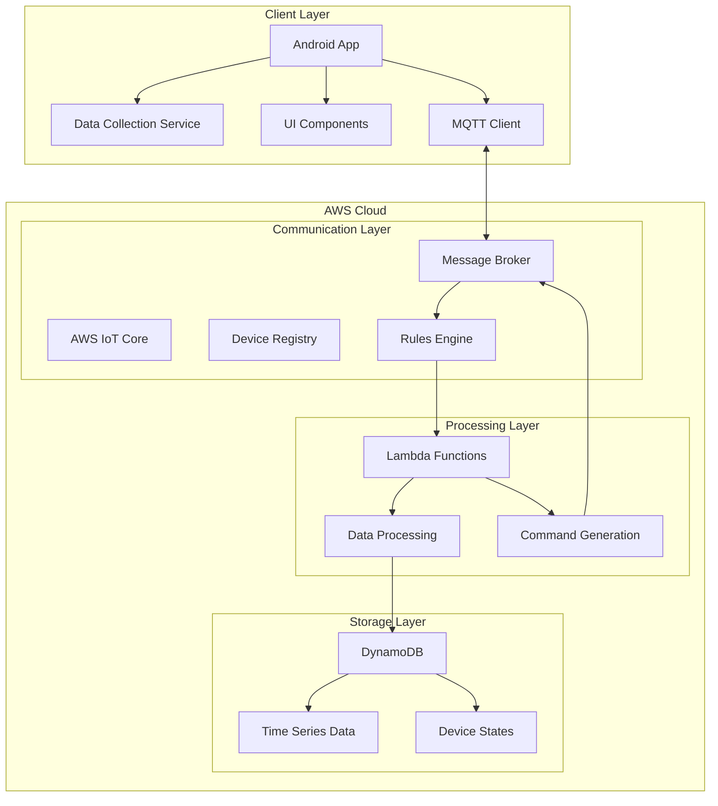
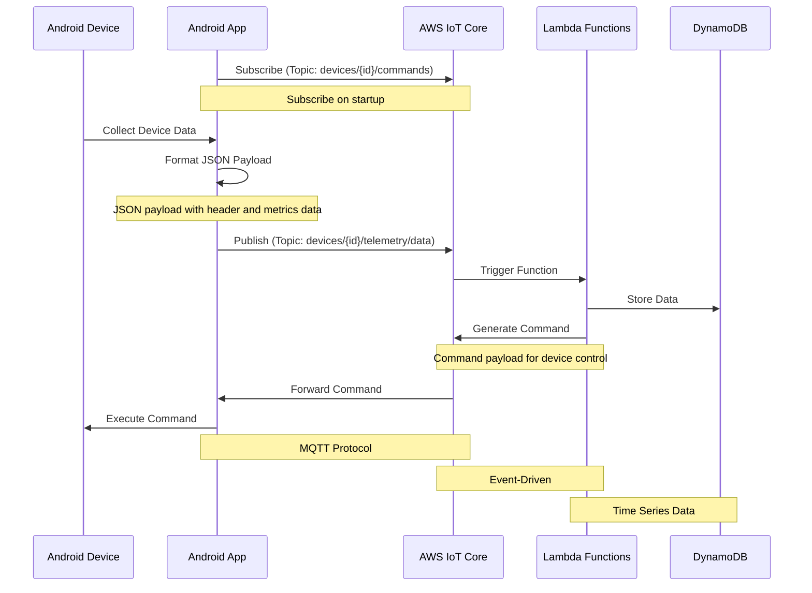

# **Android** Monitor System Design Document

## 1. Problem Statement

Modern android management faces the following challenges:

- Traditional device control systems lack adaptability, requiring manual configuration and parameter adjustments
- Device data is scattered, lacking a unified platform for data collection and analysis
- Difficulty in automatically optimizing device settings based on user behavior and environmental changes

This project aims to:

- Establish an intelligent device monitoring system for automatic data collection and analysis
- Implement remote monitoring and control through AWS IoT
- Build a foundation for future intelligent decision-making systems

## 2. Audience

### Primary Users

- android users: Individuals needing convenient device management
- System administrators: Technical personnel responsible for system monitoring and maintenance

### Secondary Users

- Developers: Engineers needing to integrate or extend system functionality
- Data analysts: Professionals analyzing device usage data

## 3. Requirements

### 3.1 Functional Requirements

**1. android User**

​	•	**User Story #1:**

As a android User, I want my device to automatically adjust screen brightness based on ambient light and usage patterns, so that I can maintain comfortable visibility and extend battery life.

​	•	**User Story #2:**

As a android User, I want my device to automatically toggle Bluetooth on/off after a certain period of inactivity, so that I can reduce battery drain and minimize manual actions.

​	•	**User Story #3:**

As a android User, I want my device to stay connected to the cloud whenever possible or queue data while offline, so that usage data will be uploaded once the network is available.


**2. System Administrator**

​	•	**User Story #1:**

As a System Administrator, I want to remotely view real-time statuses (Wi-Fi, Bluetooth, Battery, Brightness, etc.) for all enrolled devices, so that I can quickly detect and resolve any fleet-wide issues.

​	•	**User Story #2:**

As a System Administrator, I want to send remote commands (e.g., enable Wi-Fi, lock screen brightness) via AWS IoT Core, so that I can enforce company policies and standardized configurations.

​	•	**User Story #3:**

As a System Administrator, I want to manage device/user configuration profiles in a centralized console, so that I can apply or revoke permissions and settings systematically.


**3. Data Analyst**

​	•	**User Story #1:**

As a Data Analyst, I want to retrieve historical usage data (e.g., screen brightness logs, Wi-Fi usage, Bluetooth connections) from the cloud, so that I can analyze trends and optimize resource usage.

​	•	**User Story #2:**

As a Data Analyst, I want to filter device data by time range, device ID, or usage patterns, so that I can feed the data into BI/ML pipelines for deeper insights.

​	•	**User Story #3:**

As a Data Analyst, I want aggregated and anonymized device metrics, so that I can ensure user privacy while still uncovering valuable usage patterns.


### 3.2 Non-Functional Requirements

#### Performance

- Data collection latency < 500ms
- Control command response time < 1s
- Support for 100+ concurrent device connections

#### Reliability

- System availability > 99.9%
- Data persistence guarantee
- Disconnect/reconnect mechanism

#### Security

- End-to-end data encryption
- Device authentication mechanism
- Access control management

#### Scalability

- Horizontal scaling capability
- Data storage elasticity
- Load balancing support

## 4. Roll-out Staging

**Phase 1: Foundation (2 Weeks)**

**Goal**

​	•	**Develop the Kotlin-based Android application first**, creating a minimal end-to-end framework to verify data flow between the device and the cloud.

**Key Tasks**

​	•	**Week 1–2**

​	•	Set up the Android project skeleton in Kotlin (establish package structure, Gradle config, etc.).

​	•	Configure AWS IoT Core environment (create IoT things, set up certificates, define policies).

​	•	Implement a **basic** MQTT publish/subscribe flow to confirm that messages can be sent from the Android app to AWS IoT Core.

**Deliverable**

​	•	**Demo**: Demonstrate sending a **single data point** (e.g., placeholder brightness value) from the Kotlin-based Android app to AWS IoT Core, then storing it in DynamoDB.


**Phase 2: Core Features (2 Weeks)**

**Goal**

Expand data collection on the **Kotlin-based Android app** to capture multiple metrics and integrate back-end processing to handle them.

**Key Tasks**

​	•	**Week 3–4**

​	•	Enhance the Android data collection module (screen brightness, Bluetooth status, Wi-Fi info, battery level).

​	•	Integrate DynamoDB to store these metrics securely and reliably.

​	•	Implement basic AWS Lambda functions for data parsing, simple transformations, or logging.

**Deliverable**

​	•	**Demo**: Real-time data uploads of multiple metrics, persisted in DynamoDB, with Lambda providing basic aggregations or checks.


**Phase 3: Control System (2 Weeks)**

**Goal**

Enable remote commands (e.g., toggling device settings) and create a basic UI for monitoring and control.

**Key Tasks**

​	•	**Week 5–6**

​	•	Implement command-downlink logic via AWS IoT Core (e.g., enable/disable Bluetooth, adjust brightness).

​	•	Develop a minimal UI (e.g., a simple web console or additional Android UI screens) to visualize device status and send control commands.

​	•	Perform functional tests combining data flow and remote control.

**Deliverable**

​	•	**Demo**: Show how commands are sent from a console/UI to the device, with the Kotlin Android app executing them and returning updated status.


**Phase 4: Polish (2 Weeks)**

**Goal**

Conduct thorough system integration tests, optimize performance, and finalize documentation.

**Key Tasks**

​	•	**Week 7–8**

​	•	Perform end-to-end integration testing (Android app, AWS IoT Core, Lambda, DynamoDB, UI).

​	•	Fine-tune performance (reduce latency, optimize data handling, manage MQTT quality of service).

​	•	Complete all documentation: architecture diagrams, user/developer guides, and future enhancement plans.

**Deliverable**

​	•	**Demo**: A stable, near-production system running on physical Android devices (Kotlin-based), demonstrating automated data collection, remote control, and comprehensive documentation.


## 5. Architecture Diagram

```markdown
System Components:
1. Client Layer
   • Android Application
     - Data Collection Service
     - UI Components
     - MQTT Client

2. Communication Layer
   • AWS IoT Core
     - Message Broker
     - Device Registry
     - Rules Engine
     - Device Shadows

3. Processing Layer
   • Lambda Functions
     - Data Processing
     - Command Generation
     - Business Logic

4. Storage Layer
   • DynamoDB
     - Time Series Data
     - Device States
     - Configuration
```



## 6. UML Diagram

**1. Device Data Upload Sequence**

​	1.	**Device → Android App**

​	•	Collect device data (e.g., Wi-Fi, Bluetooth, brightness).

​	•	Format data into a JSON or structured payload.

​	2.	**Android App → AWS IoT Core**

​	•	Publish to a topic, for example: /device/{device_id}/data.

​	•	Include key fields: device_id, data_type, timestamp, etc.

​	3.	**AWS IoT Core → Lambda**

​	•	IoT Rule triggers a Lambda function whenever a message is published to /device/+/data.

​	•	Lambda receives device data in the event payload.

​	4.	**Lambda → DynamoDB (One Table)**

​	•	Construct primary keys to store data as an event item:

​	•	PK = DEVICE#<device_id>

​	•	SK = EVENT#<data_type>#<timestamp>

​	•	Write the record to the SmartDeviceData table, including relevant attributes (e.g., wifi_info, bluetooth_info, brightness_level).


**2. Control Command Flow**

​	1.	**Lambda → AWS IoT Core**

​	•	Generate a command (e.g., {"command_type":"TOGGLE_BLUETOOTH","target_state":"off"}).

​	•	Publish to /device/{device_id}/command via IoT Core’s Publish API.

​	2.	**AWS IoT Core → Android App**

​	•	Android App subscribes to /device/{device_id}/command.

​	•	Upon receiving a new command, parse and validate it.

​	3.	**Android App → Device**

​	•	Execute the command at the system level (e.g., disable Bluetooth, change brightness).

​	•	Optionally upload execution results (success/failure) as a new event.


**3. One Table DynamoDB Design (Example)**

​	•	**Table Name**: SmartDeviceData

​	•	**Partition Key (PK)**: PK

​	•	Example: DEVICE#<device_id>

​	•	**Sort Key (SK)**: SK

​	•	For events: EVENT#<data_type>#<timestamp>

​	•	For configs: CONFIG#<config_key>


Sample “Wi-Fi Event” item:

```
{

 "PK": "DEVICE#ABC123",

 "SK": "EVENT#WIFI#1691234567",

 "device_id": "ABC123",

 "data_type": "WIFI",

 "timestamp": 1691234567,

 "wifi_info": {

  "ssid": "Office_WiFi",

  "strength": 80

 }

}
```




## 7. Database Schema

**DynamoDB Table: SmartDeviceData**

**1. Key Design**

​	•	**Partition Key (PK):** PK

​	•	Example format: DEVICE#<device_id>

​	•	e.g., DEVICE#ABC123

​	•	**Sort Key (SK):** SK

​	•	Use prefixes to distinguish events and configurations:

​	•	**Events:** EVENT#<data_type>#<timestamp>

​	•	e.g., EVENT#WIFI#1691234567

​	•	e.g., EVENT#BLUETOOTH#1691234600

​	•	e.g., EVENT#BRIGHTNESS#1691234650

​	•	**Config:** CONFIG#<config_key>

​	•	e.g., CONFIG#bluetooth_autotoggle

​	•	e.g., CONFIG#brightness_threshold


**2. Attributes**

​	1.	**Common Fields**

​	•	device_id: Redundant device ID storage (for debugging or GSI queries).

​	•	timestamp: Time when the event or config was recorded/updated.

​	2.	**Event Items**

​	•	data_type: Type of event (e.g., WIFI, BLUETOOTH, BRIGHTNESS).

​	•	wifi_info: Map with details like ssid and strength.

​	•	bluetooth_info: Map or boolean/string indicating Bluetooth status.

​	•	brightness_level: Numeric (0–100).

​	•	battery_level: Numeric (0–100).

​	•	device_status: String representing the device’s state (e.g., active, idle).

​	3.	**Config Items**

​	•	config_key: Name of the config (e.g., "bluetooth_autotoggle", "brightness_threshold").

​	•	config_value: Could be a number, string, or JSON containing config details.

​	•	update_time: Last update timestamp.

​	•	updated_by: Who or what system performed the update.


**3. Sample Items**

**3.1 Event Example**

```
{

 "PK": "DEVICE#ABC123",

 "SK": "EVENT#WIFI#1691234567",

 "device_id": "ABC123",

 "data_type": "WIFI",

 "timestamp": 1691234567,

 "wifi_info": {

  "ssid": "Office_WiFi",

  "strength": 80

 },

 "battery_level": 55,

 "device_status": "active"

}
```

**3.2 Config Example**

```
{

 "PK": "DEVICE#ABC123",

 "SK": "CONFIG#brightness_threshold",

 "device_id": "ABC123",

 "config_key": "brightness_threshold",

 "config_value": {

  "min": 30,

  "max": 80

 },

 "update_time": 1691200000,

 "updated_by": "admin_user"

}

```


**4. Query Patterns**

​	1.	**By Device ID**

​	•	PK = DEVICE#<device_id> returns all events and configs for that device.

​	2.	**By Event Type and Time Range**

​	•	Filter on SK prefix (EVENT#WIFI#) and timestamp range to retrieve Wi-Fi event history.

​	3.	**By Config**

​	•	Filter on SK prefix CONFIG# to fetch all config records for that device.

​	4.	**Cross-Device Queries**

​	•	For something like “all Bluetooth events in the last hour,” create a GSI on data_type + timestamp as needed.


## 8. Future Expansion

### Technical Enhancements

```markdown
1. Machine Learning Integration
   - User behavior pattern recognition
   - Predictive device control
   - Anomaly detection

2. Real-time Analytics
   - Stream processing
   - Real-time dashboards
   - Performance monitoring

3. Advanced Security
   - Multi-factor authentication
   - Enhanced encryption
   - Security auditing
```

### Feature Expansion

```markdown
1. Multi-device Support
   - Cross-device synchronization
   - Device group management
   - Unified control interface

2. Advanced Analytics
   - Custom reporting
   - Data visualization
   - Trend analysis

3. Platform Extensions
   - Web interface
   - iOS application
   - API gateway
```

### Infrastructure Improvements

```markdown
1. Multi-region Deployment
   - Geographic redundancy
   - Load distribution
   - Disaster recovery

2. Monitoring & Alerting
   - System health monitoring
   - Performance metrics
   - Automated alerts

3. DevOps Integration
   - CI/CD pipeline
   - Automated testing
   - Infrastructure as code
```
